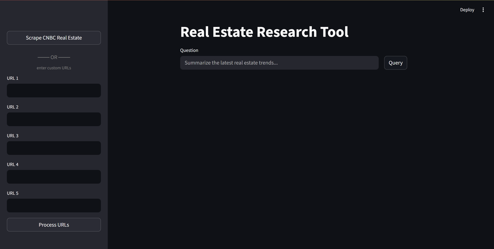
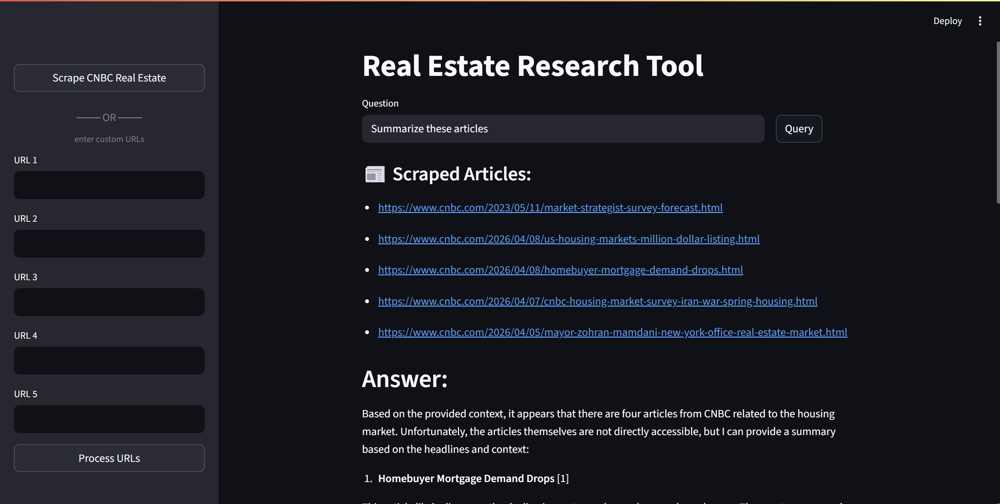
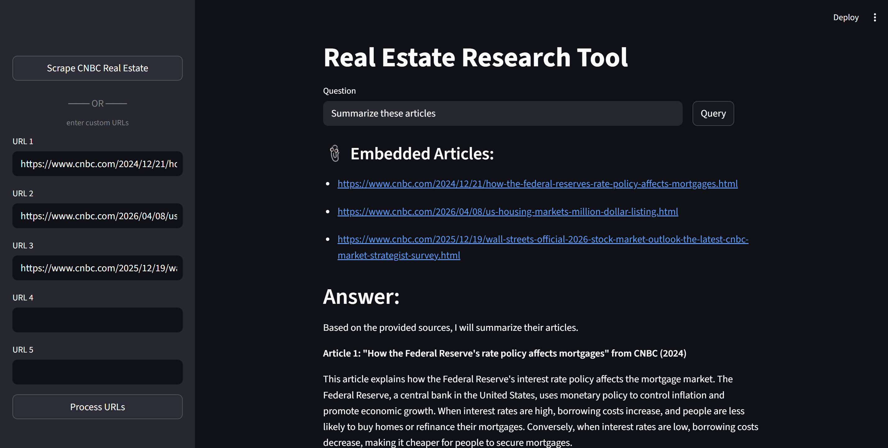

# Real Estate Research Assistant

An AI-powered research tool for querying real estate and finance articles. Scrape the latest CNBC Real Estate articles or provide your own URLs, then ask questions answered with source citations.

**Live App:** [View on Streamlit Cloud](https://genai-real-estate-assistant-akha5ab4it59rgi9r74yjk.streamlit.app/)

## Screenshots

<!-- Add screenshots here -->






## Features

- **CNBC Scraper** — automatically fetches the 5 most recent articles from CNBC Real Estate
- **Custom URLs** — manually provide up to 5 article URLs
- **RAG pipeline** — chunks and embeds documents into a local vector store, then retrieves relevant context for each query
- **Source citations** — every answer includes the source URLs used to generate it
- **Persistent vector store** — embeddings are saved locally and reused across sessions

## Tech Stack

| Component | Library |
|---|---|
| UI | Streamlit |
| LLM | Groq (`llama-3.1-8b-instant`) |
| Embeddings | HuggingFace (`BAAI/bge-large-en-v1.5`) |
| Vector store | ChromaDB |
| RAG chain | LangChain (LCEL) |
| Web scraping | Requests + BeautifulSoup |

## Project Structure

```
├── main.py          # Streamlit UI
├── rag.py           # URL processing and answer generation
├── chains.py        # LCEL retrieval chain
├── scraper.py       # CNBC Real Estate scraper
├── messages.py      # All UI status and error strings
└── requirements.txt
```

## Setup

1. **Install dependencies**
   ```bash
   pip install -r requirements.txt
   ```

2. **Create a `.env` file** with your Groq API key:
   ```
   GROQ_API_KEY=your_key_here
   USER_AGENT=real-estate-assistant/1.0
   ```

3. **Run the app**
   ```bash
   streamlit run main.py
   ```

## Usage

1. In the sidebar, click **Scrape CNBC Real Estate** to auto-load the latest articles, or paste up to 5 custom URLs and click **Process URLs**
2. Wait for the documents to be embedded into the vector store
3. Type a question and click **Query**

## Deployment (Streamlit Cloud)

The vector store uses in-memory mode on Streamlit Cloud (since the filesystem is ephemeral), so you will need to re-process URLs on each session. Locally, embeddings persist in `resources/vectorstore/`.
